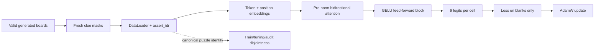

# Axis

[](https://crates.io/crates/axis)
[](https://docs.rs/axis)
[](https://github.com/furkanhaney/axis/actions/workflows/ci.yml)
[](https://www.rust-lang.org/)
[](https://developer.nvidia.com/cuda-toolkit)
[](https://github.com/NVlabs/cutile-rs)
[](LICENSE.md)


[crates.io](https://crates.io/crates/axis) · [latest GitHub release](https://github.com/furkanhaney/axis/releases/latest) ·
[Why Axis](docs/direction/thesis.md) · [Vision](docs/direction/vision.md) · [Library contract](docs/design/library.md) ·
[Contributing](CONTRIBUTING.md) · [License](LICENSE.md) · [Trademarks](TRADEMARK.md)


Axis is an experimental Rust framework for training neural networks on
[NVIDIA cuTile](https://github.com/NVlabs/cutile-rs). It uses named tensor axes
to make the math visible in code, and it lets an experiment crash when one of
its scientific assumptions stops being true.

Deep-learning programs are unusually good at being wrong while continuing to
run. A loader wraps around, train and evaluation samples overlap, a class axis
is reduced by accident, or a population of models quietly shares one set of
weights—and the loss still goes down. Axis treats those as executable contracts.

> **Project status:** Axis is active experimental research software. It is
> CUDA-only, and its API can change as new consumer programs expose better
> boundaries. The repository records measured witnesses, but does not claim
> production readiness or framework-wide performance parity.

Add the current crates.io release to a Rust project:

```bash
cargo add axis@0.11.0
```

## Executable research checks

These are what Axis is for. Each one guards an assumption a result depends on,
runs inside the training loop, fails before the offending step reaches the
optimizer, and returns a receipt that says exactly what was verified.

| Assumption | Check | What it catches |
|---|---|---|
| Every sample is new | `SinglePass`, `FinitePasses` | a step-count edit that turns a fresh-sample run into repeated passes over a finite corpus |
| Repetition stays within a declared rate | `Idr` with `IdrLimits` | a generator or loader that repeats examples more than the experiment allows |
| Train and evaluation never share an example | `Disjointness` over an `IdentityScheme` | overlap by *meaning*, not by file or seed: the same puzzle after relabeling, the same document through two shards |
| The model actually learned | `LearningProgress` | a loop that runs every forward, backward and step while one declared metric on one declared evaluation population never improves |
| A property holds on ordered inputs | `EmpiricalMonotonicity` | violations of a claimed monotone relation, recorded as sampled evidence rather than a global guarantee |
| A physical law is satisfied | `EmpiricalResidual` | a model whose residual against a named law, region and evaluator exceeds its declared limit |
| The run can be reproduced | `Trainer::step_training` with a `TrainingPass` | nondeterministic randomness: every random layer draws from a seed derived from the run seed and the step, and the step receipt names it |

Axis distinguishes data claims that ordinary loaders collapse into one:

```text
single pass                 no finite example is intentionally reused
finite passes               reuse is explicit and counted
no exact sample reuse       observed stable identities do not repeat
IDR approximation           declared coverage and repeat limits still hold
semantic disjointness       canonical identities do not cross populations
```

A receipt never claims more than was checked. Passing `assert_idr()` does not
prove independent samples or a rich underlying distribution; it proves the
declared operational conditions. A sampled monotonicity check says "sampled",
and learning progress says "improved by this much on this population", not
"converged". Receipts (`IdrReceipt`, `DisjointnessReceipt`,
`LearningProgressReceipt`, ...) are the fragments a
[run certificate](docs/contracts/run-certificates.md) is built from. The
contracts are in [data regimes](docs/contracts/data-regimes.md),
[semantic disjointness](docs/contracts/disjointness.md),
[learning progress](docs/contracts/learning-progress.md),
[static guarantees](docs/design/static-guarantees.md) and the
[library design](docs/design/library.md).

## A training loop

```rust
use axis::prelude::*;

let (batch, input, hidden, output) = (
    Axis::new("batch"),
    Axis::new("input"),
    Axis::new("hidden"),
    Axis::new("output"),
);

let mut model = Sequential::new((
    Linear::new(input, hidden.of(16)),
    ReLU,
    Linear::new(hidden, output.of(1)),
));
model.build(&Shape::new([batch.of(256), input.of(2)])?, &device, 42)?;

let mut data = DataLoader::new(AdditionDataset::new(0xadd1_7100), 256)?
    .assert_idr(IdrLimits::generated(0.0)?)?;
let mut trainer = Trainer::new(SGD::new(0.25)?);
```

There are no epochs in this example because the source never ends. If a draw ID
repeats, IDR fails. A separate `Disjointness` ledger compares canonical problem
identities across training and evaluation, so the run also fails when distinct
draw IDs encode the same reference problem. Streaming mode discards training
keys after comparison, keeping memory bounded by the retained evaluation data.

## Sudoku as an acceptance test

Axis includes a Rust migration of
[`furkanhaney/sudoku-transformer`](https://github.com/furkanhaney/sudoku-transformer).
It is a useful framework test because the task is easy to inspect while the
program exercises a real transformer: learned token and position embeddings,
bidirectional multi-head attention, pre-LayerNorm residual blocks, GELU,
blank-only categorical loss, AdamW, and whole-puzzle accuracy.

The data source generates valid boards and fresh clue masks indefinitely. The
same run tests Axis's infinite-data-regime assertion and a semantic
disjointness ledger whose identity is the clue board after canonical digit
relabeling.



The first bounded run trained a 3,129-parameter acceptance model on 50 fresh
boards. Evaluation loss fell from `2.8734` to `2.2069`; all 50 training IDs were
unique and overlap with the eight fixed evaluation boards was zero. Accuracy
remained near chance, so this is a mechanics result rather than a Sudoku-solving
claim.

On a rented RTX 5090, the same tiny model completed 200 updates over 1,600 fresh
boards: evaluation loss moved from `2.8734` to `2.1707`, blank accuracy reached
`14.93%`, reuse and evaluation overlap remained zero, and exact solves remained
zero. Peak GPU utilization was only 6% for that run, which makes launch count
and contraction lowering the measured performance frontier rather than a
throughput success claim.


## Conformance with PyTorch

Axis is not a PyTorch clone, but a model ported from PyTorch should compute the
same thing, and that is checked rather than assumed.

- **Feature parity.** PyTorch 2.14's `torch.nn` layer catalog is frozen as a
  161-row spec and each class is graded against Axis's own definition of a
  finished module: a named-axis contract, explicit state, an independent oracle
  for forward and every gradient, CUDA coverage including reordered storage, and
  documented defaults. Today **112 yes, 16 partial, 33 no: 72.05%**
  ([catalog](docs/nn/catalog.md)). `scripts/checks/nn_gap.sh --check` recomputes
  the number on every gate and fails if it drops below its floor; the rows still
  `no` are the ones the backlog defers on purpose (lazy modules, data-parallel
  wrappers, fractional pooling) and the ones waiting on persistent training
  state (BatchNorm).
- **Numerical conformance.** Every operator is tested forward and backward
  against an independent oracle written as literals or reimplemented from
  PyTorch's documented formula, never computed by the code under test. The full
  gate runs 226 CUDA tests and 67 host tests.
- **Against PyTorch itself.** `pytorch_activation_forward_and_gradient_parity`
  runs PyTorch alongside Axis (set `AXIS_PYTHON` to an interpreter with torch)
  and compares values and gradients. Eight research studies ported from PyTorch
  (a byte language model, a Voronoi bottleneck, an upscaler, a cell partitioner,
  a multiple-instance classifier, a Fourier MLP, an energy fit and a U-Net
  block) each carry a small Axis crate that reproduces a PyTorch forward and
  loss, with observed error below `1e-5` in every case.
- **Known, stated divergences** are named on the operator, for example `gelu`
  is PyTorch's tanh form and `gelu_exact` its default, and a `logsumexp` group of
  all non-finite values returns NaN where PyTorch returns negative infinity.

### Execution

The backend enqueues each eager training step on one CUDA stream and
synchronizes once at the step boundary. Single-axis contractions use batched
tiled GEMM; multi-axis contractions retain the generic gather/reduce path.
Layout permutations and split/merge use rank-sized device indexing, retaining
identity transforms as storage views. Broadcast/reduction operations reuse CPU
and bounded device-side index plans.
FP32 is the default, with an explicit BF16-matrix/FP32-state device policy.
Convolution materializes FP32 patch tensors before contraction; volumetric
patches can therefore dominate memory, and later generic broadcast/reduction
operations retain their own index-plan limits.
Set `AXIS_PROFILE=1` to print Trainer phases, tensor planning, submission, read,
and synchronization timings while investigating a workload. These are host
wall times, not CUDA kernel durations; see the [execution profile](docs/backend/execution.md).

## Learning paths and measured programs

Programs are grouped by the background needed to understand their claim. This is an audience
ladder, not a leaderboard: verification, monotonicity, and data-regime contracts do not sit beside
introductory training merely because all of them are executable.

Framework verification stays with its owner in `src/library/` tests, repository `tests/`, and
`data/evidence/`. Empirical monotonicity and IDR belong to research-contract programs or outside
research consumers. They are checks on a declared claim, not another kind of beginner example.

### Getting started

| Program | Purpose | Current witness |
|---|---|---|
| [MNIST](src/examples/getting-started/mnist/README.md) | recognizable finite-pass categorical training | bounded smoke improves held-out accuracy from 10.16% to 33.98% |
| [Fashion-MNIST](src/examples/getting-started/fashion-mnist/README.md) | train-fitted preprocessing and a less separable grayscale task | bounded smoke improves held-out accuracy from 9.77% to 47.66% |
| [CIFAR-100](src/examples/getting-started/cifar100/README.md) | named-axis RGB convolution and 100-class training | bounded smoke lowers pass loss to 4.4359 and improves held-out accuracy to 2.54% |
| [ImageNet64](src/examples/getting-started/imagenet64/README.md) | licensed large-data preparation and a compact 1,000-class CNN | deterministic parser tests plus a [real-pixel one-step GPU receipt](src/examples/getting-started/imagenet64/data/evidence/real-validation-smoke.txt); no accuracy claim |

### Training building blocks

These are ordinary model and optimizer flows. “Training” is broader and more accurate than
“layers”: Muon is an optimizer, while CNN, MLP, and attention are compositions.

| Program | Purpose | Current witness |
|---|---|---|
| [MLP](src/examples/training/mlp/README.md) | library and explicit cuTile baseline | both reach `5.74e-2` held-out MSE after 500 steps |
| [CNN](src/examples/training/cnn/README.md) | convolution forward/backward and learning | configured grouped convolution matches a scalar oracle; a depthwise-separable block composes; smoke reaches 100% accuracy |
| [Attention](src/examples/training/attention/README.md) | causal attention and prefix-mean learning | central differences pass; held-out MSE falls to `2.39e-2` |
| [Muon](src/examples/training/muon/README.md) | explicit Muon/AdamW partition and paired learning | both identically initialized arms reduce held-out MSE by more than 99% in 100 steps; no winner claim |

### Research contracts

| Program | Purpose | Current witness |
|---|---|---|
| [Generated addition](src/studies/contracts/generated-addition/README.md) | endless data with executable IDR assumptions | 128,000 fresh samples, zero observed reuse; held-out MSE falls to `3.88e-3` |
| [MNIST population](src/studies/contracts/mnist-population/README.md) | independent models and rates on one population axis | fused four-member smoke improves best accuracy from 8.20% to 60.55% |
| [Sudoku transformer](https://github.com/furkanhaney/sudoku-transformer) | bidirectional transformer plus generated IDR acceptance | 50 unique training boards, zero evaluation overlap, finite forward/backward/update |
| [Chess transformer](https://gitlab.com/furkanhaney/chess-transformer) | geometric attention, joint policy/value learning, finite game-disjoint data | two AdamW updates, exact pass receipt, zero train/evaluation overlap |

### Applied studies

| Program | Purpose | Current witness |
|---|---|---|
| [Country panel](src/studies/energy-output/panel/README.md) | AdamW and split/preprocessing migration | bounded validation MSE falls on country and future splits; no GDP-fit claim |
| [Damped pendulum](src/studies/physics/damped-pendulum/README.md) | physics-informed learning from a nonlinear ODE | RK4 angle/velocity RMSE reach `0.00749` rad and `0.01102` rad/s; strict sampled residual limit passes |

These numbers are repository witnesses with different tasks and budgets. They
show that the exercised path works; they are not a benchmark leaderboard.

## Project structure

```text
axis/
├── src/
│   ├── library/              published Axis framework crate
│   ├── examples/
│   │   ├── getting-started/
│   │   │   ├── cifar100/      100-class RGB convolution
│   │   │   ├── fashion-mnist/ clothing classification
│   │   │   ├── imagenet64/    licensed large-data CNN starting point
│   │   │   ├── mnist/         approachable end-to-end training
│   │   │   └── vision-data/   strict shared dataset and training adapters
│   │   └── training/
│   │       ├── attention/    causal-attention consumer and oracle
│   │       ├── cnn/          CNN consumer and scalar oracle
│   │       ├── mlp/          MLP consumer and explicit cuTile baseline
│   │       └── muon/         paired Muon and AdamW learning acceptance
│   └── studies/
│       ├── contracts/
│       │   ├── generated-addition/  generated-data IDR training
│       │   └── mnist-population/    population-axis research contract
│       ├── energy-output/
│       │   └── panel/        country-year regression migration
│       └── physics/
│           └── damped-pendulum/ nonlinear ODE residual acceptance
├── docs/                     shared contracts, assumptions, and next work
├── data/                     tracked evidence and selected runs; other contents ignored
├── scripts/                  CUDA setup, Cargo runner, checks, and censuses
├── Cargo.toml                workspace and shared dependency versions
└── Cargo.lock                one resolved dependency graph
```

The original Python programs behind the migrations remain in the sibling
`research` repository. Each migration document names the source and separates
preserved mechanics from claims it has not reproduced.

## Setup

Requirements:

- Linux and an NVIDIA GPU supported by cuTile
- Rust 1.89 or newer
- `libclang`
- CUDA 13.2

Provision the repository-local CUDA toolkit when the host does not already have
a compatible toolkit:

```bash
bash scripts/setup_cuda.sh
```

The generated `build/cuda/` and Cargo `target/` directories stay local. CUDA's six
library aliases are materialized as independent regular files after every
setup invocation, including when all package markers already match. The setup
rejects any other symlink in the local toolkit. The only external direct Rust
dependency is pinned `cutile = "=0.3.1"`.

## Run

Run commands from the repository root:

```bash
bash scripts/check.sh

bash src/examples/getting-started/mnist/scripts/train.sh --smoke
bash src/examples/training/mlp/scripts/train.sh --smoke
bash src/examples/training/cnn/scripts/train.sh --smoke
bash src/examples/training/attention/scripts/train.sh --smoke
bash src/examples/training/muon/scripts/train.sh --smoke
bash src/studies/contracts/generated-addition/scripts/train.sh --smoke
bash src/studies/contracts/mnist-population/scripts/train.sh --smoke
bash src/studies/energy-output/panel/scripts/train.sh --smoke --split country
bash src/studies/physics/damped-pendulum/scripts/train.sh --smoke
```

`check.sh` runs formatting, Clippy, CPU tests, and serialized CUDA tests. The
ignored test suite needs an NVIDIA device and is intentionally driven by the
script.

## Where Axis is going

The [project thesis](docs/direction/thesis.md) is to give coordinates to the whole
experiment, not only its tensors. It grows against an [acceptance
ladder](docs/contracts/acceptance.md): the
Sudoku and Chess transformers are current, and running the sub-30B model behind
`ask_second_opinion` is the long-range systems test.

The current implementation frontier is recorded in [next work](docs/direction/next.md).

## Contributing and license

Human and agent-assisted contributions are welcome. Start with the
[contribution guide](CONTRIBUTING.md), which explains how changes are scoped,
verified, and presented for review.

Original Axis material is available under the [MIT License](LICENSE.md).
Dependencies, downloaded toolchains and datasets, and linked external artifacts
retain their own licenses and terms.
