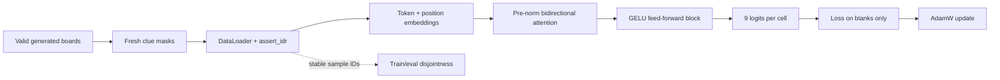

# Axis

[](https://www.rust-lang.org/)
[](https://developer.nvidia.com/cuda-toolkit)
[](https://github.com/NVlabs/cutile-rs)


Axis is an experimental Rust framework for training neural networks on
[NVIDIA cuTile](https://github.com/NVlabs/cutile-rs). It uses named tensor axes
to make the math visible in code, and it lets an experiment crash when one of
its scientific assumptions stops being true.

Deep-learning programs are unusually good at being wrong while continuing to
run. A loader wraps around, train and evaluation samples overlap, a class axis
is reduced by accident, or a population of models quietly shares one set of
weights—and the loss still goes down. Axis treats those as executable contracts.

## A training loop

```rust
use axis::prelude::*;

let (batch, input, hidden, output) = (
    Axis::new("batch"),
    Axis::new("input"),
    Axis::new("hidden"),
    Axis::new("output"),
);

let mut model = Sequential::new((
    Linear::new(input, hidden.of(16)),
    ReLU,
    Linear::new(hidden, output.of(1)),
));
model.build(&Shape::new([batch.of(256), input.of(2)])?, &device, 42)?;

let mut data = DataLoader::new(AdditionDataset::new(0xadd1_7100), 256)?
    .assert_idr(IdrLimits::generated(0.0)?)?;
let mut trainer = Trainer::new(SGD::new(0.25)?);
```

There are no epochs in this example because the source never ends. If a sample
identity repeats or crosses into the evaluation population, the run fails and
prints a receipt explaining why.

## Sudoku as an acceptance test

Axis includes a Rust migration of
[`furkanhaney/sudoku-transformer`](https://github.com/furkanhaney/sudoku-transformer).
It is a useful framework test because the task is easy to inspect while the
program exercises a real transformer: learned token and position embeddings,
bidirectional multi-head attention, pre-LayerNorm residual blocks, GELU,
blank-only categorical loss, AdamW, and whole-puzzle accuracy.

The data source generates valid boards and fresh clue masks indefinitely.
Training and evaluation occupy separate identity namespaces, so the same run
also tests Axis's infinite-data-regime and disjointness assertions.



The first bounded run trained a 3,129-parameter acceptance model on 50 fresh
boards. Evaluation loss fell from `2.8734` to `2.2069`; all 50 training IDs were
unique and overlap with the eight fixed evaluation boards was zero. Accuracy
remained near chance, so this is a mechanics result rather than a Sudoku-solving
claim.

On a rented RTX 5090, the same tiny model completed 200 updates over 1,600 fresh
boards: evaluation loss moved from `2.8734` to `2.1707`, blank accuracy reached
`14.93%`, reuse and evaluation overlap remained zero, and exact solves remained
zero. Peak GPU utilization was only 6% for that run, which makes launch count
and contraction lowering the measured performance frontier rather than a
throughput success claim.


## What works

- Named axes, explicit contraction, broadcasting, splitting, merging, masking,
  softmax, categorical and binary cross-entropy, and squared error.
- Reverse-mode differentiation with parameter version checks and explicit
  scalar loss reduction.
- `Linear`, `PopulationLinear`, valid stride-one `Conv2d`, `LayerNorm`, `ReLU`,
  `GELU`, and `Sequential` modules.
- Device-resident SGD, Adam, and AdamW. Adam can assign one learning rate to
  each member of a named population axis.
- Finite datasets, generated streams, exact shuffled passes, single-pass and
  IDR guards, and train/evaluation identity separation.
- A `Trainer` that fixes update order: clear gradients, construct a fresh loss,
  backpropagate, then update once.

The backend enqueues each eager training step on one CUDA stream and
synchronizes once at the step boundary. Single-axis contractions use batched
tiled GEMM; multi-axis contractions retain the generic gather/reduce path.
FP32 is the default, with an explicit BF16-matrix/FP32-state device policy.

## Measured programs

| Program | Purpose | Current witness |
|---|---|---|
| [MLP](src/mlp/README.md) | library and explicit cuTile baseline | both reach `5.74e-2` held-out MSE after 500 steps |
| [CNN](src/cnn/README.md) | convolution forward/backward and learning | 4,096 activations plus all gradients match a scalar oracle; smoke reaches 100% accuracy |
| [Attention](src/attention/README.md) | causal attention and prefix-mean learning | central differences pass; held-out MSE falls to `2.39e-2` |
| [Generated addition](src/addition/README.md) | endless data with executable IDR assumptions | 128,000 fresh samples, zero observed reuse; held-out MSE falls to `3.88e-3` |
| [MNIST](src/mnist/README.md) | finite-pass categorical training migration | bounded smoke improves held-out accuracy from 10.16% to 33.98% |
| [MNIST population](src/mnist-population/README.md) | independent models and rates on one population axis | fused four-member smoke improves best accuracy from 8.20% to 60.55% |
| [Country panel](src/panel/README.md) | AdamW and split/preprocessing migration | bounded validation MSE falls on country and future splits; no GDP-fit claim |
| [Sudoku transformer](https://github.com/furkanhaney/sudoku-transformer) | bidirectional transformer plus generated IDR acceptance | 50 unique training boards, zero evaluation overlap, finite forward/backward/update |
| [Chess transformer](https://gitlab.com/furkanhaney/chess-transformer) | geometric attention, joint policy/value learning, finite game-disjoint data | two AdamW updates, exact pass receipt, zero train/evaluation overlap |

These numbers are repository witnesses with different tasks and budgets. They
show that the exercised path works; they are not a benchmark leaderboard.

## Project structure

```text
axis/
├── src/
│   ├── axis/                 reusable framework crate
│   ├── mlp/                  MLP consumer and explicit cuTile baseline
│   ├── cnn/                  CNN consumer and scalar oracle
│   ├── attention/            causal-attention consumer and oracle
│   ├── addition/             generated-data IDR training
│   ├── mnist/                migrated finite-pass MNIST baseline
│   ├── mnist-population/     migrated population learning-rate probe
│   └── panel/                migrated country-year regression mechanics
├── docs/                     shared contracts, assumptions, and next work
├── data/                     workspace-wide verification records
├── scripts/                  CUDA setup, Cargo runner, checks, and censuses
├── Cargo.toml                workspace and shared dependency versions
└── Cargo.lock                one resolved dependency graph
```

The original Python programs behind the three migrations remain in the sibling
`research` repository. Each migration document names the source and separates
preserved mechanics from claims it has not reproduced.

## Setup

Requirements:

- Linux and an NVIDIA GPU supported by cuTile
- Rust 1.89 or newer
- `libclang`
- CUDA 13.2

Provision the repository-local CUDA toolkit when the host does not already have
a compatible toolkit:

```bash
python3 scripts/setup_cuda.py
```

The generated `.cuda/` and Cargo `target/` directories stay local. CUDA's six
library aliases are materialized as independent regular files after every
setup invocation, including when all package markers already match. The setup
rejects any other symlink in the local toolkit. The only external direct Rust
dependency is pinned `cutile = "=0.3.1"`.

## Run

Run commands from the repository root:

```bash
bash scripts/check.sh

bash src/mlp/scripts/train.sh --smoke
bash src/cnn/scripts/train.sh --smoke
bash src/attention/scripts/train.sh --smoke
bash src/addition/scripts/train.sh --smoke
bash src/mnist/scripts/train.sh --smoke
bash src/mnist-population/scripts/train.sh --smoke
bash src/panel/scripts/train.sh --smoke --split country
```

`check.sh` runs formatting, Clippy, CPU tests, and serialized CUDA tests. The
ignored test suite needs an NVIDIA device and is intentionally driven by the
script.

## Research invariants

Axis distinguishes related claims that ordinary loaders often collapse:

```text
single pass                 no finite example is intentionally reused
finite passes               reuse is explicit and counted
no exact sample reuse       observed stable identities do not repeat
IDR approximation           declared coverage and repeat limits still hold
train/evaluation disjoint   observed identities do not cross the boundary
```

Passing `assert_idr()` does not prove independent samples or a rich underlying
distribution. It proves the declared operational conditions and produces a
receipt. The broader rule is that an experimental assumption should fail in the
program when the run stops satisfying it.

The [project thesis](docs/thesis.md) is to give coordinates to the whole
experiment, not only its tensors. It grows against an [acceptance
ladder](docs/acceptance.md): the
Sudoku and Chess transformers are current, and running the sub-30B model behind
`ask_bro` is the long-range systems test.

The detailed contracts are in [library design](docs/library.md),
[data regimes](docs/data-regimes.md), [static guarantees](docs/static-guarantees.md),
and [run certificates](docs/run-certificates.md). The current implementation
frontier is recorded in [next work](docs/next.md).
