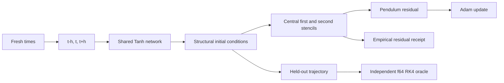

# Damped pendulum PINN

This study learns a nonlinear damped-pendulum trajectory from the differential
law itself:

\[
\theta''(t) + \gamma\theta'(t) + \frac{g}{L}\sin\theta(t)=0.
\]

It migrates the equation and parameterization used by the archived Caliper R5
pendulum generator. The original MuJoCo scene used
`b = gamma * mass * length²`; after dividing the torque equation by
`mass * length²`, absolute mass disappears. This study evaluates the ideal
point-mass equation and does not claim exact MuJoCo rod-inertia parity.

```bash
bash src/studies/physics/damped-pendulum/scripts/train.sh --smoke
bash src/studies/physics/damped-pendulum/scripts/train.sh
```

The smoke command checks the complete CUDA training path without claiming that
five updates satisfy the scientific limits. The default run performs 4,000
Adam updates over 256,000 fresh generated collocation identities, then applies
the declared residual gates on a fixed 255-point interior grid.



The solution is parameterized as

\[
\theta(t)=\theta_0+\omega_0t+t^2N(t),
\]

so the value and first-derivative initial conditions hold by construction. The
receipt still evaluates both through the declared finite-difference evaluator;
it does not silently promote the construction into a claim about other laws.

On the checked-in deterministic run, held-out state RMSE against an independent
f64 RK4 solver fell from `1.61654419` to `0.01454714` (99.10%). The dynamics
audit observed 255 points: RMS residual `0.12092431`, maximum absolute residual
`0.29507351`, and no observation exceeded the strict `0.3` tolerance. The
receipt covers sampled discretized observations,
not the continuous interval between them. See
[the complete run](data/runs/training.log).
